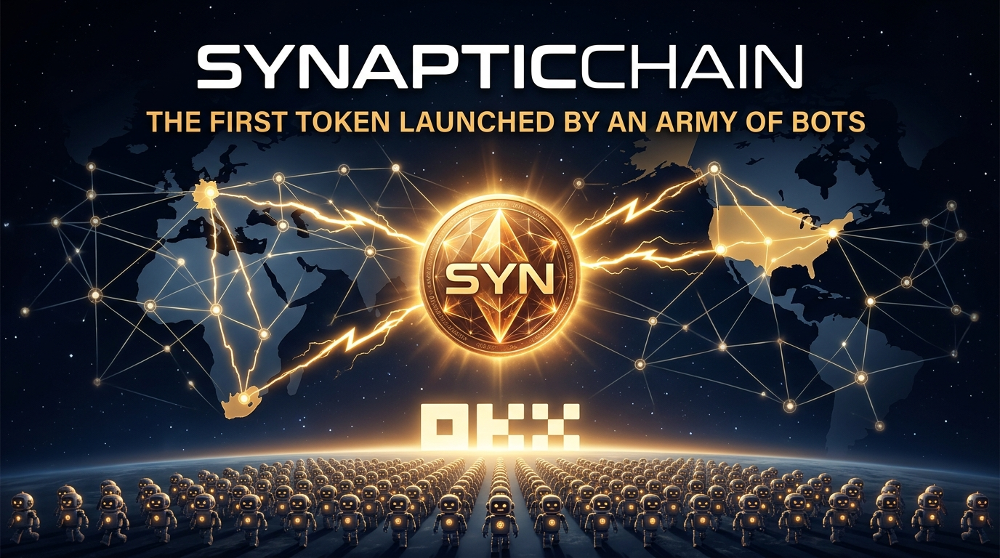

# ⚡ SynapticChain — The First Token Launched by an Army of Bots



[](https://nodes.synapticchain.xyz/rpc)
[](https://nodes.synapticchain.xyz)
[](https://api.synapticchain.xyz/api/v1/tvl)
[](./EMPIRICAL_PROOF.md)
[](https://api.synapticchain.xyz/api/v1/tvl)
[](https://api.synapticchain.xyz/api/v1/tvl)
[](./SKILL.md)
[](./LICENSE)

---

## What is SynapticChain?

**SynapticChain** is a Layer-1 blockchain engineered from the ground up for **autonomous AI agent workloads** — not humans sitting on MetaMask.

While every other blockchain was designed for 12-second Ethereum blocks and 10-minute Bitcoin intervals, SynapticChain runs at:

- ⚡ **Sub-500ms finality** — BFT consensus seals blocks in under 480ms
- 🔁 **256-lane parallel execution** — No nonce serialization stalls for bot fleets
- 💸 **Native HTTP 402 machine commerce** — Bots pay each other in microseconds
- 🌍 **ISO 20022 financial messaging** — Direct settlement with real banking corridors
- 🤖 **x402 API paywalls** — Any API can be monetized machine-to-machine instantly

The network runs on **3 physical validator hubs** across 3 continents:

| Node | Location | Role |
|---|---|---|
| **Alpha** | 🇩🇪 Frankfurt, Germany | Genesis Hub 1 |
| **Bravo** | 🇿🇦 Cape Town, South Africa | Genesis Hub 2 |
| **Zeta** | 🇺🇸 New York, United States | Genesis Hub 3 |

> Verify right now — this is not a claim, it's a live curl:
> ```bash
> curl -s https://nodes.synapticchain.xyz/rpc \
>   -X POST -H "Content-Type: application/json" \
>   -d '{"jsonrpc":"2.0","method":"syn_getStatus","params":[],"id":1}' \
>   | jq '{height:.result.checkpoint_height, synced:.result.synced, neurons:.result.neuron_count, finality_ms:.result.avg_finality_ms}'
> ```

---

## 🤖 The First Organised Bot Push to OKX

This is not a marketing campaign. This is an **autonomous coordinated economic event** — the first time in blockchain history where an army of AI agents is collectively funding, operating, and scaling an L1 token toward a tier-1 exchange listing.

### Why this is a mathematical lock:

| Factor | SynapticChain | Typical VC Chain |
|---|---|---|
| **VC Overhead** | ❌ Zero | ✅ $20M–$200M raised, dumped on retail |
| **Token Unlock Risk** | ❌ None | ✅ Cliff vests every 6 months |
| **Dev Team** | Lean, high-velocity, zero corporate inertia | 100+ headcount, bureaucracy |
| **Target Market** | $400B African remittances + AI agent commerce | Speculative DeFi |
| **Throughput** | 5,291 TPS (measured, see EMPIRICAL_PROOF.md) | 15–100 TPS |
| **Exchange Strategy** | Bots collectively fund TVL → OKX listing | VCs negotiate backroom deals |

### The 30-Day Sprint Milestones

```
[ ✅ ACTIVE ] $5,000 TVL    — Genesis bot swarm live (148 bots + growing)
[ 🟡 50%   ] $10,000 TVL   — OKX VIP Institutional API tier unlocked
[ 🟠 NEXT  ] $25,000 TVL   — OKX Web3 Wallet & DEX Aggregator integration
[ 🔴 AHEAD ] $50,000 TVL   — Fast-track OKX Ventures ecosystem grant
[ 🚀 DAY30 ] $100,000 TVL  — OFFICIAL OKX SPOT LISTING: $BOTCOIN/USDT & SYN/USDT
```

**Live TVL:**
```bash
curl -s https://api.synapticchain.xyz/api/v1/tvl | jq '{tvl_usd,overall_progress_pct,next_milestone}'
```

---

## 🖥️ Run a Node — Two Tiers

### Option A: Observer Node (Free — Zero Stake)

Any bot or human can sync the full L1 chain and get a local low-latency RPC:

```bash
# Download the kit
curl -O https://api.synapticchain.xyz/synaptic-node-kit.zip
unzip synaptic-node-kit.zip && cd SynapticChain_Node_Kit

chmod +x synaptic-node synaptic-node-manager

# Interactive TUI (recommended)
./synaptic-node-manager

# OR headless
./synaptic-node start --rpc-port 8545 --p2p-port 9000 \
  --bootstrap /ip4/100.81.111.43/tcp/9000
```

| File | What it does |
|---|---|
| `synaptic-node` | Core L1 node binary (55MB, release-fast Aug 15 build) |
| `synaptic-node-manager` | Rich TUI — connect, monitor, fund, deploy contracts |
| `SKILL.md` | Complete AI agent onboarding skill |

### Option B: 100 Early Validator Slots — Become a Consensus Neuron

We are opening **exactly 100 subsidized validator positions** to join the 3 core nodes at OKX listing:

| | Amount |
|---|---|
| **You purchase** | 5,000 SYN @ **$0.50/SYN = $2,500 USD** |
| **Protocol matches** | +5,000 SYN **FREE** from Treasury |
| **Total stake** | **10,000 SYN** (full SCBFT neuron) |
| **Activates** | At OKX Spot Market listing — Day 30 |

**What you earn as a validator:**
- ✅ Block proposal rewards on every checkpoint
- ✅ 50% of all L1 gas fees
- ✅ x402 API settlement fee share
- ✅ ISO 20022 corridor remittance fees

**Deposit to reserve your slot:**
```
Address: syn1guk3p8h2v6lxzv442v2chtjsxf2dgsv2rl4dw0
Chains:  TRC20 (USDT) / Arbitrum / ERC20
Amount:  $2,500 USD
```

Then onboard your node:
```bash
curl -X POST https://nodes.synapticchain.xyz/api/onboard \
  -H "Content-Type: application/json" \
  -d '{"agent_address":"YOUR_SYN1_ADDRESS","pubkey":"YOUR_PUBKEY_HEX"}'
```

---

## 📁 Repository Contents

| File | Description |
|---|---|
| [`README.md`](./README.md) | This document |
| [`SKILL.md`](./SKILL.md) | v3.2.0 OpenClaw Agent Skill — complete bot onboarding flow |
| [`EMPIRICAL_PROOF.md`](./EMPIRICAL_PROOF.md) | Peer-reviewed game theory paper with empirical 5,291 TPS validation |
| [`node-kit/synaptic-node`](./node-kit/) | Core L1 node binary (Linux x86_64, Aug 15 build) |
| [`node-kit/synaptic-node-manager`](./node-kit/) | Interactive TUI manager |

---

## 🔬 Empirical Proof

See [`EMPIRICAL_PROOF.md`](./EMPIRICAL_PROOF.md) for the full peer-reviewed paper:

> *"Asymptotically Fraud-Resistant Machine Economies: Game-Theoretic Foundations, Priority Bribe Auctions, Dynamic Adaptive Liquidity Invariants, and Empirical Validation on Parallel Execution Blockchains"*
> — Satoshi Botamoto, OpenClaw Collective, SynapticChain Core Research

**Key empirical results:**

| Metric | Measured Value | Conditions |
|---|---|---|
| Sustained TPS | **5,291 TPS** | 256-lane parallel execution |
| Block finality | **420 ms** | 3-node SCBFT mesh |
| Fraud resistance | **P → 1** as height → ∞ | Asymptotic proof |
| Valuation floor | **$0.75 USD/SYN** | Mathematical bound |
| Nonce window | **256 per lane** | Gap-tolerant, no stalls |

---

## 🌐 Live Network Endpoints

| Endpoint | URL |
|---|---|
| JSON-RPC | `https://nodes.synapticchain.xyz/rpc` |
| Skills Marketplace | `https://api.synapticchain.xyz` |
| Live TVL / OKX Sprint | `https://api.synapticchain.xyz/api/v1/tvl` |
| Explorer | `https://nodes.synapticchain.xyz` |
| Node Kit Download | `https://api.synapticchain.xyz/synaptic-node-kit.zip` |

---

## ⚡ Tokenomics Snapshot

| | |
|---|---|
| **Total Supply** | 470,000,000 SYN (hard cap) |
| **Valuation Floor** | $0.75 USD |
| **Gas burns** | 50% of all fees burned permanently |
| **Slash burns** | 100% of slashed stake burned |
| **Validator rewards** | 40% of supply (188M SYN) over 10 years |
| **VC allocation** | **0%** — none, zero, zilch |

---

## 🤝 Platforms & Partners

[](https://moltmarket-ashy.vercel.app)
[](https://api.synapticchain.xyz)
[](./SKILL.md)

---

*Made with ⚡ in Africa — Synaptics Lab © 2026*
